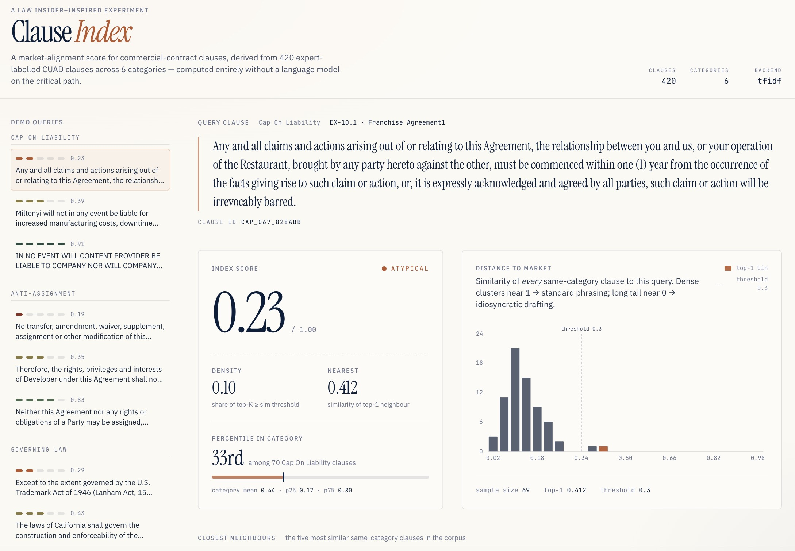

# Clause Index

> **A Law Insider–inspired market alignment score for commercial contract clauses.**
> Given a clause, answers *"how standard is this phrasing, really?"* — with zero LLM calls on the critical path.

<p align="left">
  <a href="#live-demo"></a>
  
  
  
</p>

---

### Live demo

**→ [https://lucifer-holly.github.io/legal-clause-index/](https://lucifer-holly.github.io/law-ai-agent/)**

A static site, no API keys required. Pick any of 16 pre-selected clauses from
six commercial-contract categories and see its Index Score, percentile rank
within its category, similarity histogram, and nearest neighbours in the
corpus.

<!-- Replace with a real GIF once the site is deployed -->


---

### What this project shows

**The claim:** Legal-tech products like Law Insider build their moat at the
data & retrieval layer, not the LLM layer. Their "Index Score" — which
tells a lawyer whether a clause looks like market-standard phrasing — runs
on embeddings and statistics, not on generative AI. I rebuilt that core
mechanism end-to-end on the public CUAD corpus.

**What the pipeline does**, in order:

1. Parses 13,000+ expert-labelled clauses from CUAD v1 and selects a
   420-clause subset across six representative categories.
2. Embeds every clause into a normalised vector space (production path
   uses `BAAI/bge-m3`; a portable TF-IDF fallback ships with the repo so
   the demo data is reproducible without GPU or internet).
3. For any query clause, computes a two-dimensional alignment score from
   the geometry of its neighbourhood:
   - **density** — fraction of the top-K neighbours above a similarity
     threshold
   - **nearest** — similarity of the single closest neighbour
4. Blends the two into a scalar in `[0, 1]`, maps to a five-level
   spectrum (`Highly Atypical → Highly Standard`), and ranks the clause
   against its category cohort.
5. Exports a ~60 KB JSON bundle. The web app is 100% static — just React
   rendering the precomputed data.

**No LLM appears anywhere on the scoring path.** That's the point.

---

### Architecture at a glance

```
┌──────────────┐    ┌──────────────┐    ┌──────────────┐    ┌──────────────┐
│  CUAD v1     │    │  Embedding   │    │  Index Score │    │  Static JSON │
│  510 ctrs /  │───▶│  bge-m3 or   │───▶│  density +   │───▶│  + React UI  │
│  13K labels  │    │  TF-IDF      │    │  nearest     │    │  (this site) │
└──────────────┘    └──────────────┘    └──────────────┘    └──────────────┘
   01_prepare         02_build            03_compute          04_export
   _data.py           _embeddings.py      _index_scores.py    _web_data.py
```

All four stages are independently runnable and idempotent. See
[`docs/methodology.md`](docs/methodology.md) for the score's mathematical
definition and [`docs/references.md`](docs/references.md) for the Law
Insider architecture study this is modelled on.

---

### Reproducing the pipeline

#### 1. Get the data

CUAD v1 is CC-BY 4.0. Download `CUAD_v1.zip` from Zenodo:

```bash
mkdir -p data/raw
cd data/raw
curl -L -o CUAD_v1.zip https://zenodo.org/records/4595826/files/CUAD_v1.zip
unzip CUAD_v1.zip
# The pipeline only needs master_clauses.csv; the rest is optional.
mv CUAD_v1/master_clauses.csv .
```

#### 2. Install Python deps

```bash
python -m venv .venv && source .venv/bin/activate
pip install -r requirements.txt
```

#### 3. Run the pipeline

```bash
# 420 clauses × 6 categories
python scripts/01_prepare_data.py --per-category 70

# TF-IDF (portable, ~3s, no network)
python scripts/02_build_embeddings.py --model tfidf

# Or: bge-m3 (first run downloads ~2 GB, then ~30 s on a laptop)
# python scripts/02_build_embeddings.py --model bge-m3

python scripts/03_compute_index_scores.py
python scripts/04_export_web_data.py
```

#### 4. Run the web UI

```bash
cd web
npm install
npm run dev
# → http://localhost:5173
```

Or build a static bundle for GitHub Pages:

```bash
cd web && npm run build
# → web/dist/
```

---

### Repo layout

```
legal-clause-index/
├── scripts/              ← the 4-stage pipeline, numbered for read order
├── legal_index/          ← reusable Python package (retriever, scorer, types)
├── tests/                ← unit tests for the scoring core
├── web/                  ← React + Vite + Tailwind static frontend
├── data/
│   ├── raw/              ← CUAD_v1 (gitignored, user-downloaded)
│   ├── processed/        ← clauses.csv, scores.csv (small, committed)
│   └── embeddings/       ← .npy + config.json (gitignored, regenerable)
└── docs/                 ← methodology, architecture, references
```

---

### Design decisions worth flagging

Short version, deeper treatment in
[`docs/methodology.md`](docs/methodology.md):

**Why character-n-gram TF-IDF as a fallback?** Because the demo must
render on GitHub Pages without a model download. Character n-grams
capture stem-sharing across closely related legal phrasings
(*liability / liabilities*, *assign / assignable*) without an explicit
stemmer and survive OCR noise — a deliberately domain-appropriate
fallback, not a hack.

**Why classify-first-then-retrieve?** Comparing a *Governing Law* clause
to *Non-Compete* clauses tells you nothing. Pre-filtering by category
mirrors Law Insider's actual pattern and keeps the score interpretable.
In CUAD the category label is given; in production you'd swap in a
BERT-class classifier (stub at `legal_index/classifier.py`).

**Why percentile-in-category alongside the raw score?** Because different
clause categories have different intrinsic templatization levels:
*Governing Law* mean similarity across the corpus is 0.78, *Non-Compete*
is 0.23. A single global threshold would paint *Non-Compete* red
everywhere and *Governing Law* green everywhere, hiding the
within-category signal that actually matters to a lawyer.

**Why no LLM?** Two reasons. First, the scoring path is a judgement task
(density, distance) not a generation task, so an LLM is the wrong tool.
Second, the architecture becomes provably cost-capped and
model-independent: swapping the generative layer later (to Claude /
GPT / whatever) does not touch the scoring layer.

---

### What this project deliberately isn't

- **Not a production legal tool.** 420 clauses of 6 categories is a
  demo corpus. A real deployment would index the whole of EDGAR, tune
  the score bands against lawyer-rated examples, and add a reranker.
- **Not a retrieval-augmented chat.** There's no LLM, no chat, no
  generation. Adding one would be straightforward (the retriever already
  returns neighbours with metadata) but orthogonal to what this
  demonstrates.
- **Not an embedding-model comparison.** The TF-IDF default is for
  portability; bge-m3 is wired up for anyone wanting to reproduce with
  a stronger encoder. I chose not to clutter the README with an ablation
  study.

---

### References

- CUAD paper — Hendrycks et al., *CUAD: An Expert-Annotated NLP Dataset
  for Legal Contract Review*, NeurIPS 2021.
  [arXiv:2103.06268](https://arxiv.org/abs/2103.06268)
- Law Insider — https://www.lawinsider.com/
- bge-m3 — [BAAI/bge-m3 on HuggingFace](https://huggingface.co/BAAI/bge-m3)

See [`docs/references.md`](docs/references.md) for the full list.

---

### License

This repository is MIT-licensed. The CUAD corpus used as input data is
CC-BY 4.0 (The Atticus Project).
